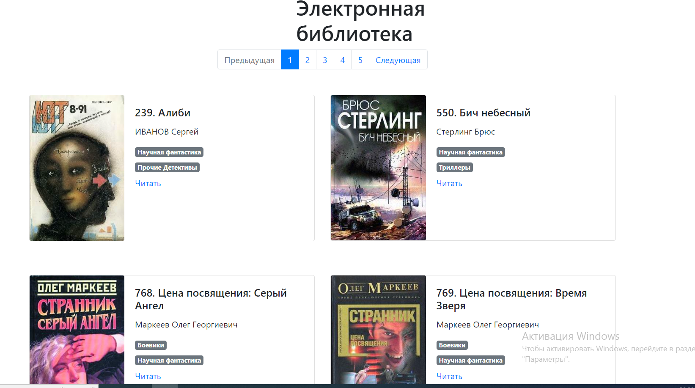

# Сайт электронной библиотеки 

Проект представляет из себя сайт электронной библиотеки [ссылка](https://kodunaiff.github.io/web_online_library/pages/index1.html).
Он создан на основе известного [интернет-ресурса tululu](https://tululu.org/). Цифры перед названием произведения, представляют из себя ID книги на основном ресурсе, если вдруг это станет вам необходимо.



## Как установить
Склонируйте репозиторий на свой компьютер.

Python3 должен быть уже установлен. Затем используйте pip (или pip3, есть есть конфликт с Python2) для установки зависимостей:
```
pip install -r requirements.txt
```

### Пример запуска кода

````
py render_website.py
````

### Цель проекта
Код написан в образовательных целях на онлайн-курсе для веб-разработчиков [dvmn.org](https://dvmn.org/).
